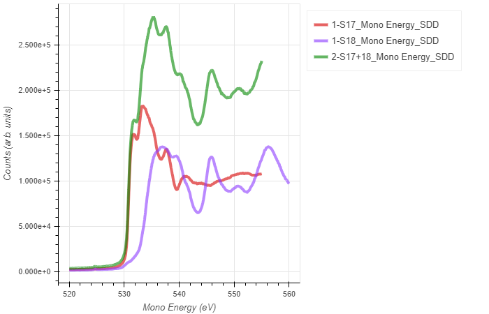
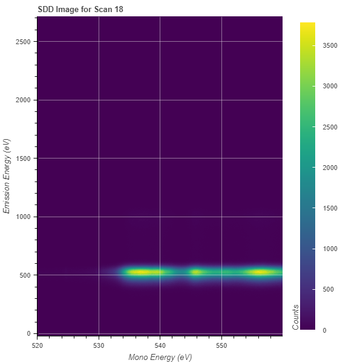
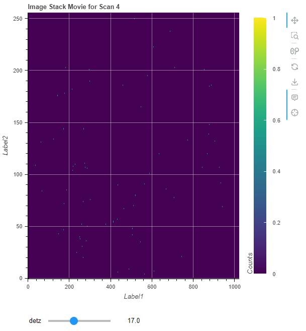

# Example plots for base classes (1d/2d/3d)

## 1d plots



This allows to make 1d plots from SCA's or reduced MCA's.

```
sca = Load1d()
sca.load(config,'FileName.h5','x_stream','y_stream',1,2,3,4)  # Loads multiple scans individually
sca.loadObj(object,line_number) # to load a previously loaded 1d object
sca.add(config,'FileName.h5','x_stream','y_stream',1,2,3,4)  # Adds multiple scans
sca.subtract(config,'FileName.h5','x_stream','y_stream',[1,2],[3,4],norm=False) # Subtracts scans (add scans in brackets, then perform subtraction between both brackets)
sca.stitch(config,'FileName.h5','x_stream','y_stream',*args, **kwargs) # Stitches multiple scans together, calculates average in overlap region.
sca.background(config,'FileName.h5','x_stream','y_stream',*args, **kwargs) # Subtracts a 1d background from all previously loaded scans (may specify multiple scans to create composite background)
sca.xlim(lower_lim,upper_lim) # Sets the horizontal axis plot region
sca.ylim(lower_lim,upper_lim) # Sets the vertical axis plot region
sca.plot_legend("pos string as per bokeh") # Determines a specific legend position
sca.show_fluorescence('element','siegbahn_symbool') # Adds a line to the plot where the requested fluorescence line is located
sca.vline(position) # Draws a vertical line
sca.hline(position) # Draws a horizontal line
sca.label(pos_x,pos_y,'Text') # Adds a label to the plot
sca.plot() # Plots the defined object
sca.export() # Exports the data by calling an exporter widget
sca.save_plot('fname') # uses the matplotlib engine to export the current plot
```

1. Create "Loader" object

2. Enter the file name of the scan to analyse ('FileName.h5') and configuration

3. Options for **x_stream** quantities include:
- All quantities contained in the sca folder(s) specified in the config
- All SCA specified in the config
- May use "" to index by points
- May use '[None]' to reduce stream to 0-d and use 2d scale as x-stream

4. Options for **y_stream** quantities include:
- All quantities contained in the sca folder(s) specified in the config
- All SCA specified in the config
- All MCA specified in the config with applied ROI
- All STACK specified in the config with two applied ROIs (need to apply curely braces to the ROI to specify integration, i.e. mcpSTACK[{1:1024},{1:512}])

5. List all scans to analyse (comma-separated)

6. Set optional flags. Options include:
- _norm_ (Normalizes to [0,1])
- _xcoffset_ (Defines a constant shift in the x-stream)
- _xoffset_ (Takes a list of tuples and defines a polynomial fit of the x-stream)
- _ycoffset_ (Defines a constant shift in the y-stream)
- _yoffset_ (Takes a list of tuples and defines a polynomial fit of the y-stream)
  e.g. offset = [(100,102),(110,112),(120,121)]
- _grid_x_ (Takes a list with three arguments to apply 1d interpolation gridding)
  e.g. grid_x = [Start Energy, Stop Energy, Delta]
- _savgol_ (Takes a list with two or three arguments to apply data smoothing and derivatives)
  e.g. savgol = [Window length, Polynomial order, deriavtive] as specified in the scipy Savitzky-Golay filter
- _binsize_ (int, allows to perform data binning to improve Signal-to-Noise)
- _legend_items_ (dict={scan_number:"name"}, overwrites generic legend names; works for the _load_ method)
- _legend_item_ (str, overwrites generic legend name in the _add_/_subtract_ method)
- _twin_y_ (to add a second bokeh axis at the right)
- _matplotlib_props_ (to specify properties to customize matplotlib exported plots)

For further documentation regarding available methods and key-word arguments, please see the API documentation.


## 2d Images

Note: This loader only supports to process and load one scan at a time!

### MCA detector data



This is to display 2d detector data.

```
load2d = Load2d()
load2d.load(config,'Filename.h5','x_stream','detector',1)
load2d.background_1d(self,config, file, x_stream, y_stream, *args, axis='y', **kwargs) # May subtract 1d data as background from all scans
load2d.background_2d(self,config, file, x_stream, detector, *args, **kwargs) # May subtract 2d data as backround from all scans
load2d.plot()
load2d.exporter()
```

1. Create "Loader" object

2. Enter the file name of the scan to analyse ('FileName.h5') and configuration

3. Options for **x_stream** quantities include:
- All quantities contained in the sca folder(s) specified in the config
- All SCA specified in the config

4. Options for **detector** quantities include:
- All MCA specified in the config
- All STACK specified in the config with applied ROI

5. Select scan to analyse (comma-separated)

7. Set optional flags. Options include:
- _norm_ (Normalizes to [0,1])
- _xcoffset_ (Defines a constant shift in the x-stream)
- _xoffset_ (Takes a list of tuples and defines a polynomial fit of the x-stream)
- _ycoffset_ (Defines a constant shift in the y-stream)
- _yoffset_ (Takes a list of tuples and defines a polynomial fit of the y-stream)
  e.g. offset = [(100,102),(110,112),(120,121)]
- _grid_x_ (Takes a list with three arguments to apply 1d interpolation gridding)
  e.g. grid_x = [Start Energy, Stop Energy, Delta]
- _norm_by_ (Normalizes to specified stream)
- _binsize_x_ (To bin data in the horizontal direction, this may truncate the image if required)
- _binsize_y_ (To bin data in the vertical direction, this may truncate the image if required)

Further methods are available, please see API documentation.

## 3d Image Stacks



Note: Can only load one scan at a time!

```
load3d = Load3d()
load3d.load(config,'Filename.h5','ind_stream','stack',1)
load3d.plot()
load3d.movie() # this will export a movie
```

1. Create "Loader" object

2. Enter the file name of the scan to analyse ('FileName.h5') and configuration

3. Enter SCA name for independent stream, corresponding to length of first axis.

4. Options for **stack** quantities include:
- All STACK specified in the config

5. Select scan to analyse

6. Set optional flags. Options include:
- _norm_ (Normalizes to [0,1])
- _xcoffset_ (Defines a constant shift in the x-stream)
- _xoffset_ (Takes a list of tuples and defines a polynomial fit of the x-stream)
- _ycoffset_ (Defines a constant shift in the y-stream)
- _yoffset_ (Takes a list of tuples and defines a polynomial fit of the y-stream)
  e.g. offset = [(100,102),(110,112),(120,121)]
- _grid_x_ (Takes a list with three arguments to apply 1d interpolation gridding)
  e.g. grid_x = [Start Energy, Stop Energy, Delta]
- _norm_by_ (Normalizes to specified stream)

Note, for movie export of a 3d object, the FFMPEG package must be installed.