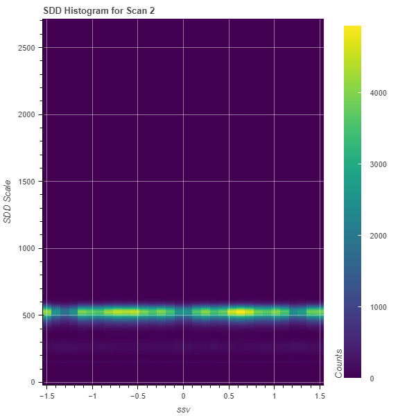
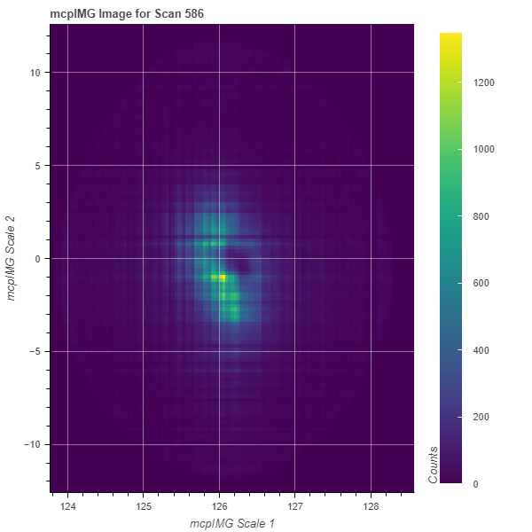

# Histogram classes

To facilitate capabilities related to imaging, i.e. working with spatial spectral data, as well as for summing over non-monotonic scales, the following histogram classes may be useful. We generally distinguish the different classes by the type of data they produce as result, i.e. 1d data, 2d images, or 3d image stacks.  Most methods as described in the API documentation and demonstrated for the 1d, 2d, and 3d base classes are accessible. 

## 1d plots

The output for any 1d histogram class will be a line plot and data may be exported as list of pairs.

### Histogram1d
#### Case 1: Histogram (1d,1d)
This class allows to process unordered data along the horizontal axis such as temperature. The data is sorted before it is displayed, just as expected for a regular 1d histogram. Note that the first 1d argument may not contain any ROI, while the second argument may be higher dimensional data with an ROI, as long as it can be reduced to 1d data, i.e. (1d, 2d-ROI) or (1d, 3d-ROI-ROI).

We demonstrate the difference between a 1d line plot and a histogram plot below:

```python
# Load the file as regular 1d plot, then compare to the Histogram
b = Load1d()
b.load(config,'reixs_files/Tutorial.h5','beam','MCP[265:285]',14)
b.plot()
a = LoadHistogram1d()
a.load(config,'reixs_files/Tutorial.h5','beam','MCP[265:285]',14)
a.plot()
```


#### Case 2: Histogram (1d-ROI,2d)
This class makes use of the histogram function as it operates on data, but returns a spectrum for which the intensity of each data point corresponds to histogrammed data with exactly 1 bin. Such implementation is useful as it allows to sum over non-ordered, i.e. monotonic, data in the first stream. As such, the horizontal axis is replaced with the scale associated with the 2d data.

```python
a = LoadHistogram1d()
a.load(config,'reixs_files/Tutorial.h5','beam[480.02:480.04]','MCP',14)
a.plot()
```


### Histogram1dReduce
#### Case: Histogram (1d-ROI,1d-ROI,2d)
This class sums over spatial coordinates and allows to display the line spectrum summed at various positions. As such, the scale associated with the 2d data will be returned as independent axis.

```python
r = LoadHistogram1dReduce()
r.load(config,'reixs_files/Tutorial.h5','ssh[-1.5:1.5]','ssv[-1.5:1.5]','SDD',2)
r.load(config,'reixs_files/Tutorial.h5','ssh[-1.5:1.5]','ssv[-0.5:0.5]','SDD',2)
r.load(config,'reixs_files/Tutorial.h5','ssh[-0.5:0.5]','ssv[-0.5:0.5]','SDD',2)
r.plot()
```


## 2d plots

All of the following histogram classes produce an image.

### Histogram2d
#### Case 1: Histogram (1d,1d,1d)
This is a regular histogram for which three 1d streams are plotted as two-dimensional histogram, typically two spatial coordinates and one intensity argument are used. As such, the last two arguments may contain ROIs as long as the data can be reduced to 1d type. This is likely the most typical case for which more extensive documentation is provided.


This class inherits from the general Load2d but overrides data loading and processing for (x,y,z) scatter data until an image is calculated.

```
mesh = LoadHistogram2d()
mesh.load(config,'Filename.h5','x_stream','y_stream','z_stream',24)
mesh.plot()
mesh.exporter()
```

1. Create "Loader" object

2. Enter the file name of the scan to analyse ('FileName.h5') and configuration

3. Options for **x_stream** quantities include:
- All quantities contained in the sca folder(s) specified in the config
- All SCA specified in the config
- All MCA specified in the config with ROI specified
- All STACK specified in the config with two ROIs specified

4. Options for **y_stream** quantities include:
- All quantities contained in the sca folder(s) specified in the config
- All SCA specified in the config
- All MCA specified in the config with ROI specified
- All STACK specified in the config with two ROIs specified

5. Options for **z_stream** quantities include:
- All quantities contained in the sca folder(s) specified in the config
- All SCA specified in the config
- All MCA specified in the config with ROI specified
- All STACK specified in the config with two ROIs specified

6. Specify scan to analyse

7. Set optional flags. Options include:
- _norm_ (Normalizes to [0,1])
- _xcoffset_ (Defines a constant shift in the x-stream)
- _xoffset_ (Takes a list of tuples and defines a polynomial fit of the x-stream)
- _ycoffset_ (Defines a constant shift in the y-stream)
- _yoffset_ (Takes a list of tuples and defines a polynomial fit of the y-stream)
  e.g. offset = [(100,102),(110,112),(120,121)]
- _binsize_x_ (To bin data in the horizontal direction, this may truncate the image if required)
- _binsize_y_ (To bin data in the vertical direction, this may truncate the image if required)

#### Case 2: Histogram (1d-ROI,1d,2d)
For mesh/map scans with two independent axes, one may wish to sum over one independent axis (entirely or a region) and display 2d data as function of the second independent axis.

```python
o = LoadHistogram2d()
o.load(config,'reixs_files/Tutorial.h5','ssh[-1.25:0.25]','ssv','SDD',2,norm=False)
o.plot()
```



#### Case 3: Histogram (1d-ROI,1d-ROI,3d)
Similar as case 2 above, one may choose to sum over two independent axes in a 3d image stack. As a result, a summed image with the stack scales as horizontal and vertical coordinates, respectively, are displayed.

```python
s = LoadHistogram2d()
s.load(config,'reixs_files/LNSCO110b_586.h5','th[60:61]','tth[126.3:126.5]','mcpIMG',586)
s.plot()
```


### Histogram2dSum
The Histogram2dSum class is a specialization of case 2 above where summation happens over all non-specified scanned (independent) axes. It also allows to sum non-monotonic independent axes for 3d data.

#### Case 1: Histogram (1d,2d)
This is the equivalent of Case 2 above.

```python
s = LoadHistogram2dSum()
s.load(config,'reixs_files/Tutorial.h5','ssh','SDD',2)
s.plot()
```


#### Case 2: Histogram (1d-ROI,3d)
Similar to case 3 above, whereas here summing over a non-ordered first axis is permitted.

```python
s = LoadHistogram2dSum()
s.load(config,'reixs_files/LNSCO110b_586.h5','th[60:61]','mcpIMG',586)
s.plot()
```



## 3d plots

### Histogram3d
This class displays stacks of 2d images which can be scrolled through with a slider.

#### Case: Histogram (1d,1d,2d)
In particular, the implementation allows to scroll through the scale axis of a 2d data stream, displayed against two independent axes. The video below shows the histogram produced with an energy-dispersive silicon drift detector, for which all emission (detector) energies are displayed over time.

```python
h3 = LoadHistogram3d()
h3.load(config,'reixs_files/Tutorial.h5','ssh','ssv','SDD',2,binsize_z=10)
h3.plot()
```

<video src="_static/Histogram3d.mp4" controls></video>