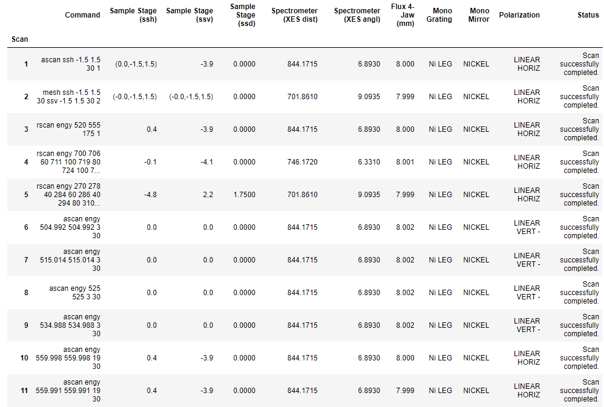

# Meta Data

Meta data is important information that is not directly captured from a measurement but can rather be thought of as a snapshot of experiment equipment, capturing operation conditions at data collection. Such meta data can be extremly beneficial in post-processing as it serves as detailed log which measurement operation has been performed in which experimental environment.

## Meta Data Plot

.")

Given that multiple scans are stored per file, we can plot meta data as a function of scan number

```
bl = LoadBeamline()
bl.load(config,'Filename.h5','path to variable')
bl.plot()
```

1. Create "Loader" object

2. Enter the file name of the scan to analyse ('FileName.h5') and configuration

3. Options for **path to variable** quantities include:
- All directory paths within the specified h5 file

## Spreadsheet/Logbook



```
df = LoadLog()
df.load(config,'Filename.h5',columns,average=True)
df.show() # Shows the log (data frame) interactively
df.export('filename.csv') # export to csv
```

1. Create "Loader" object

2. Enter the file name of the scan to analyse ('FileName.h5') and configuration

3. Options for **columns** quantities include:
- Custom dictionary with column headers and quantities, see example below:

```
columns = dict()

columns['Command'] = 'command'
columns['Sample Stage (ssh)'] = 'Endstation/Motors/ssh'
columns['Sample Stage (ssv)'] = 'Endstation/Motors/ssv'
columns['Sample Stage (ssd)'] = 'Endstation/Motors/ssd'
columns['Spectrometer (XES dist)'] = 'Endstation/Motors/spd'
columns['Spectrometer (XES angl)'] = 'Endstation/Motors/spa'
columns['Flux 4-Jaw (mm)'] = 'Beamline/Apertures/4-Jaw_2/horz_gap'
columns['Mono Grating'] = '/Beamline/Monochromator/grating'
columns['Mono Mirror'] = '/Beamline/Monochromator/mirror'
columns['Polarization'] = 'Beamline/Source/EPU/Polarization'
columns['Status'] = 'status'
```

Multiple meta data items may be combined as tuples, i.e. ('comment1','comment2'), and get added as one column to the log
Rounding may be applied to numbers, i.e. ['/path/to/item',int] where int stands for the number of decimal places

4. Specify average boolean
- If False, return all data (even if 1d array)
- If True, return average of 1d array where applicable