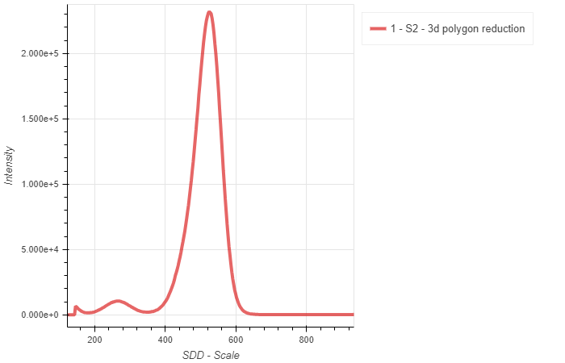
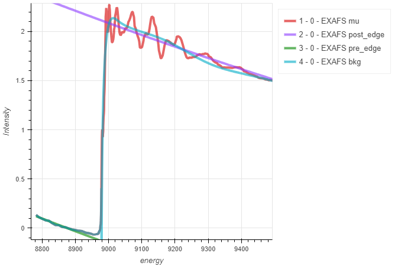
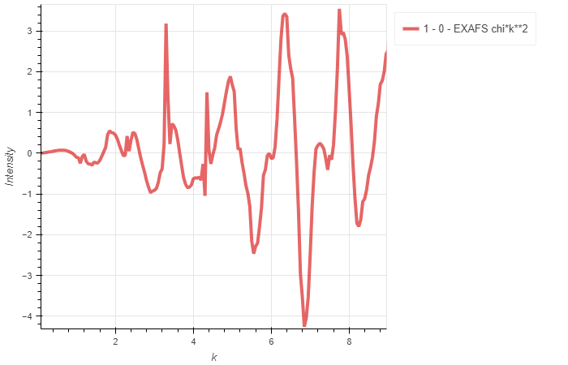

# Math and Object operations

Various mathematical data operations beyond the scope of initial data reduction are also incorporated in the software. This mostly relies on working with previously loaded & reduced objects. This has the advantage that math operations can be performed with data that was initially stored in different data files.

Note that these data classes inherit from the LoadData base classes, so all methods associated with the base classes (Load1d and Load2d) are typically available as well.

## Accessing LoadData objects

When loading in objects created by the LoadData module, generally three pieces of information need to be supplied:
* the name of the object
* the index of the data entry in the objects data list attribute - this generally correpsonds to the index of the line of a load/add/subtract/stitch call, where we start indexing with 0
* The scan number of the scan to be accessed

### Example

Given the following object:

```
sca = Load1d()
sca.load(config,'FileName.h5','x_stream','y_stream',1,2,3,4)
sca.add(config,'FileName.h5','x_stream','y_stream',11,12,13,14)
sca.subtract(config,'FileName.h5','x_stream','y_stream',[21,22],[23,24])
sca.plot()
```

To access the loaded scan #4 from the first line, the required information is:

```
(sca,0,4) # object name, index (line of applied method, starting at 0), scan number
```

For "composite" scans, i.e. scans added/subtracted/stitched/etc., the resulting scan number is always 0 for easier reference. Thus, referencing the 1d subtraction can be achieved with:

```
(sca,2,0) # object name, index (this is the 4th line, 3rd data append method, thus index 2), scan 0 since this is a composite scan
```

## Object1dAddSubtract

This applies addition and subtraction of 1d scan objects, hence allowing to add and subtract scans from multiple data files. All scans to be added, and if desired, scans to be subtracted, need to be specified individually:

```
m = Object1dAddSubtract()
m.add(o,0,17)
m.add(o,0,18)
m.subtract(o,2,0)
m.evaluate()
m.plot()
```

1. Create "Loader" object

2. Add scans to be added (execute the add method once per scan)

3. Optional, specify the subtract method

4. Evaluate the result

## Object1dStitch

Stitches multiple 1d scans together and takes the average in case there is overlap between scans.

```
m = Object1dStitch()
m.stitch(o,0,17)
m.stitch(o,0,18)
m.stitch(o,2,0)
m.evaluate()
m.plot()
```

1. Create "Loader" object

2. Specify all scans to be stitched together (execute this method once per scan that needs to be processed)

3. Evaluate the result

## Object1dTransform

:::{card} {octicon}`alert-fill;1em;sd-text-info` Requirements
To use this feature, ensure that ```pybaselines``` is installed!
:::

Applies a baseline to 1d data and allows to subtract the modelled background. This may be especially useful for hard x-ray spectroscopy and imaging where the scattering background for higher energies is large.

```
l = Object1dTransform()
l.load(o,0,0)
l.baseline('arpls',subtract=False)
l.baseline('arpls',subtract=True)
l.plot()
```

1. Create "Loader" object

2. Specify scan (from object) that shall be treated with a baseline background subtraction

3. Apply the baseline as available from the ```pybaselines``` package. See here for implemented algroithms: [pybaseline ReadTheDocs](https://pybaselines.readthedocs.io/en/latest/algorithms/index.html). If requested, Savitsky-Golay smoothing can be explicitly applied to the data before the data streams are handed to the baseline algorithm.

4. Plot results


## Object2dAddSubtract

Just as for 1d scans, we may add and subtract multiple 2d images.

```
w = Object2dAddSubtract()
w.add(o,0,15) # object, line, scan
w.subtract(o,0,15)
w.evaluate()
w.plot()
```

1. Create "Loader" object

2. Add scans to be added (execute the add method once per scan)

3. Optional, specify the subtract method

4. Evaluate the result

## Object2dStitch


Similar to the 1d case, this allows stitching of 2d images.

```
s = Object2dStitch()
s.stitch(m1,0,2)
s.stitch(m2,0,2)
s.stitch(m3,0,2)
s.evaluate(average=True)
s.plot()
```

1. Create "Loader" object

2. Specify all scans to be sticthed together (execute this method once per scan that needs to be processed)

3. Evaluate the result. You may specify whether the overlap is averaged (Boolean True) or if the first scan takes precedence and overlap from conescutive scans is disregarded (Boolean False).

## Object2dReduce

This class allows to reduce a 2d image to 1d data by integration along one axis. Integration can either be performed withing a rectangular region of interest (ROI) or within a polygon.

### Region of Interest Reduction

```
p = Object2dReduce()
p.load(o,0,15)
p.roi('y',roi=(600,660)) # Apply  the ROI
p.apply_kwargs(ycoffset=100000) # May choose to apply 1d key-word arguments to the resulting data
p.plot()
```

1. Create "Loader" object

2. Specify one 2d object to be loaded and processed.

3. Evaluate the result. Here, we apply an ROI within the designated range and sum along the 'y' axis.

4. Upon data reduction to 1d, further math operations as typically specified through 1d key-word arguments may be applied.

### Polygon Reduction

It is often useful to specify the summation region as polygon to include/exclude certain features. A prime example would be x-ray emission data on graphene oxide, where elastic lines are quite strong and oxygen may be detected by the spectrometer in second order if tuned to the C K-edge.

```
p = Object2dReduce()
p.load(o,0,15)
p.polygon('y',[(-5,635),(10,655),(10,655),(-5,655)],exact=False)
p.plot()
```

1. Create "Loader" object

2. Specify one 2d object to be loaded and processed.

3. Evaluate the result. Here, we apply a polygon as defined in the list of coordinates, moving counter-clockwise. Per definition, the software will always choose the circumscribed area for summation.

Note, that the key-word argument exact may be defined. Exact evaluation processes every data point in a nested loop separately and gives the most accurate result. This comes at high processing costs (time). Alternatively, by default, exact evaluation is disabled and an image algorithm (scikit's polygon2mask) is used to mask a polygon by filling holes. This is typically much faster, but results may not be as accurate.

## Object2dTransform

### Excitation-Emission Maps


This allows to apply math operations on a 2d object on a per data point basis. All data points on the second axis may be recalculated based on an equation provided the independent primary axis. Additionally, the transpose of an image may be calculated.

Such data processing may be valuable when dealing with excitation emission maps at the transition metal L-edges for which a transformation of the map to energy loss scale may be advantageous to identify excitations and their origin.

```
o = Object2dTransform()
o.load(config,'Tutorial.h5','beam','MCP',15)
o.transform('x-y',xlim=(None,None),ylim=(None,None))
o.transpose()
o.plot()
```

1. Create "Loader" object

2. Specify one 2d object to be loaded and processed.

3. Specify a transformation. This is applied to every data point "x" of the independent axis. To be specific, "x" is a single value accessed in a for loop, while "y" refers to the entire array of the secondary axis. Similarly "z" corresponds to the entire matrix of the image.

For most transformations, the output dimensions are cropped to maximize the 'y' axis. This may not necessarily be desirable, hence, additional key-word arguments in the ```transform``` method allow to specify and limit both 'x' and 'y' directions. The ```xlim``` crops the data stream before the transformation is applied, while ```ylim``` is evaluated after the transformation. Then, the maximum area is determined.

4. We transpose the matrix and switch the scales accordingly.

### Baseline subtraction

This works similar to the 1d case above (see: ```Object1dTransform```) with an integrated ```baseline``` method.

## Object3dHistogramTransform

This works similar to the 1d case above (see: ```Object1dTransform```) with an integrated ```baseline``` method.

## Object3dHistogramReduce

```python
rh = Object3dHistogramReduce()
rh.load(h3,0,2)
rh.polygon([(-1.5,-1.5),(1.5,-1.5),(1.5,1.5),(-1.5,1.5)])
rh.plot()
```

1. Create "Loader" object

2. Specify one Histogram3d object to be loaded and processed.

3. With the implemented polygon method, an arbitrary polygon with a list of (x,y) coordinate pairs may be specified.

4. On execution, the Histogram stack is reduced to a 1d line plot such that only the intensities contained in the polygon are used for summing. Thus, this method is similar to the ```LoadHistogram1dReduce``` class but allows summing over any region defined by an enclosed polygon.




## Object1dFit


It is often useful to fit to spectral features. For 1d data, a simple fitting routine relying on the ```lmfit``` package is accessible and is exosed to users through easy syntax in this fitting class. A composite fit model may be build with the following available lineshapes which are built-in ```lmfit``` models:

* Gaussian
* Constant
* Linear
* Quadratic
* Polynomial
* Exponential
* Lorentzian

```
f = Object1dFit()
f.load(o,0,8)
f.add_Gaussian(535.5,500,1) #Parameters: center, amplitude, sigma
f.evaluate(lower_limit=None,upper_limit=None,fit='best')
f.plot()
f.fit_values()
f.fit_report()
```

1. Create "Loader" object

2. Specify one 1d object to be loaded and processed.

3. Start building a composite model by adding line shapes. This may only be one line shape (as is the case here), or multiple line shapes that build up a composite model. Note that different models require different parameters to be specified. Please see the API documentation section for more information. Additionally, parameters may be constrained by specifying additional bounds as tuple, i.e. ```center_bounds=(None,None)```.

4. The composite model may then be evaluated on the previously supplied data. Options include to specify lower and upper fitting limits for the minimizer. Also the ```fit``` key-word allows to choose, whether the 'best' fit, 'initial fit', or the 'components' of the best fit are displayed.

5. You may choose to either print the best ```fit_values``` or the entire ```fit_report```.

## Object1dEXAFS



To judge the quality of EXAFS data, it is important to look at the extended portion of the spectrum and convert it to k-space. From there, one may apply a Fourier transform to R-space for further analysis. Such operations are directly supported to be carried out with the integrated ```xraylarch``` engine.

:::{card} {octicon}`alert-fill;1em;sd-text-info` Requirements
To use this feature, ensure that ```xraylarch``` is installed!
:::

```
p = Load1d()
p.load(vespers,'vespers_files/Cu-foil_xafs_1_20210728_123251.hdf5','EnergyFeedback','trans',0)
q = Object1dEXAFS()
q.load(p,0,0)
q.calculate_autobk(rbkg=0.85, kweight=2)
q.calculate_xftf(kweight=2, kmin=2, kmax=13.0, dk=5, kwindow='Kaiser-Bessel')
q.evaluate('energy','mu')
q.evaluate('energy','post_edge')
q.evaluate('energy','pre_edge')
q.evaluate('energy','bkg')
#q.evaluate('k','chi*k**2')
#q.evaluate('r','chir_mag')
#q.evaluate('r','chir_re')
q.plot()
```

1. Create EXAFS "Loader" object (this is ```q``` in the example above)

2. Specify one 1d object to be loaded and processed (```p``` in the example above). Note that the data must be in the conventional format with the ```x_stream``` being energy and the ```y_stream``` being mu.

3. Calculate the background and forward Fourier Transform of the EXAFS using the ```xraylarch``` engine. See ```xraylarch``` documentation for applicable key-word arguments.

4. Evaluate the results and specify the (x,y) quantities to be displayed. You may choose from all ```xraylarch``` group attributes. Math can be applied to these quantities as shown above.

