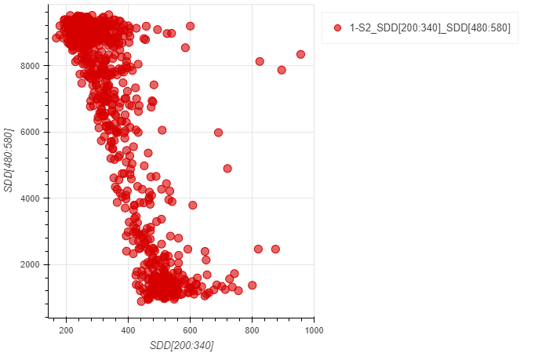

# 1d Scatter Plots

To analyze the correlation between two data streams, scatter plots provide a useful tool for investigation. It is generally sufficient to provide two data streams that can be reduced to 1d. For such analysis, one will typically want to plot two dependent quantities against each other.

In the example below, we use an XRF map (mesh scan) to show the correlation of Carbon concentration and Oxygen concentration as detected via the Ka fluorescence lines, captured with the SDD detector.

```python
a = LoadScatter1d()
a.load(config,'reixs_files/Tutorial.h5','SDD[200:340]','SDD[480:580]',2)
a.plot()
```


